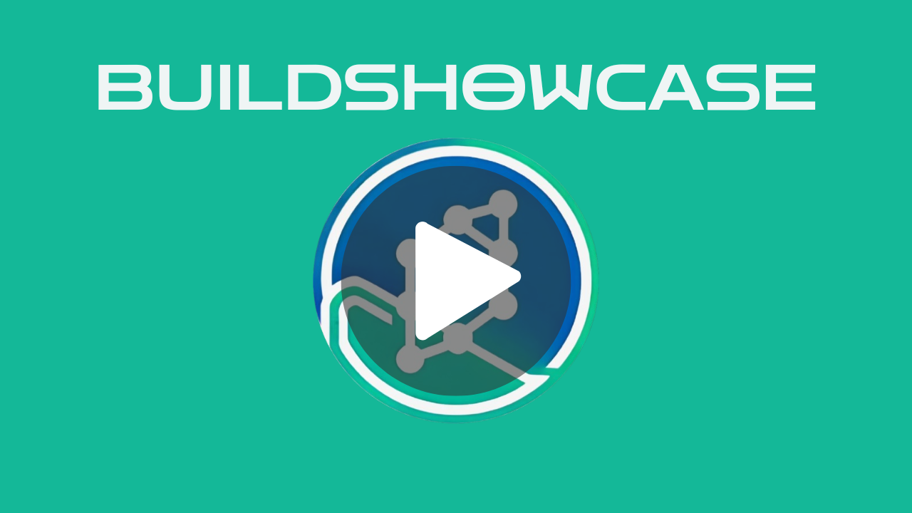
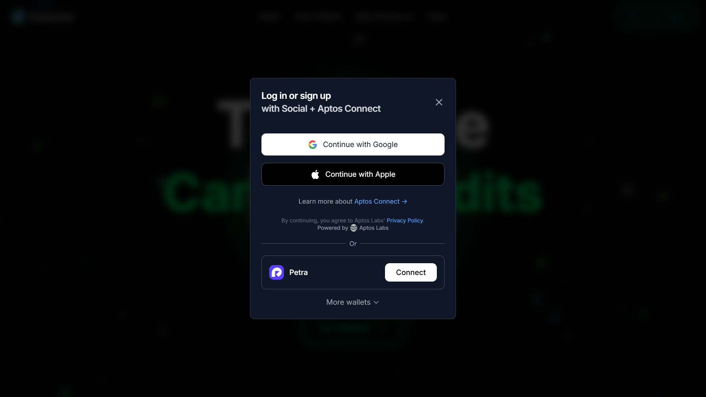
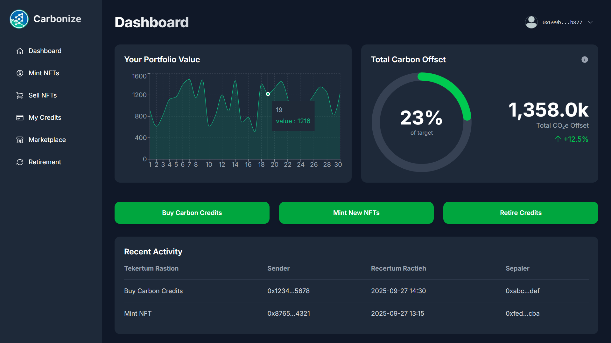
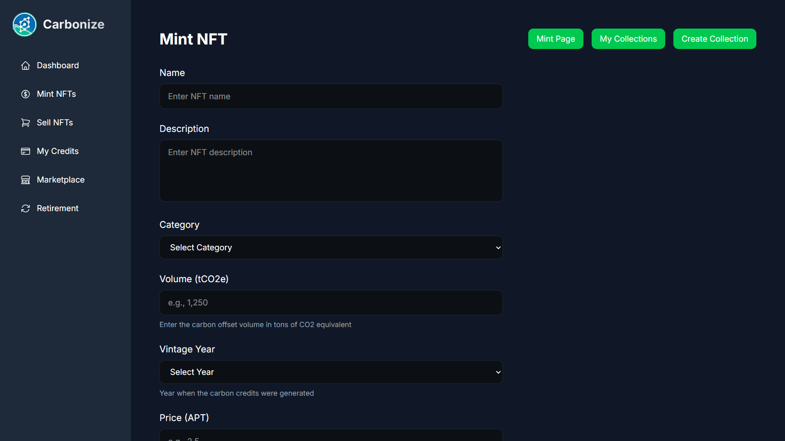
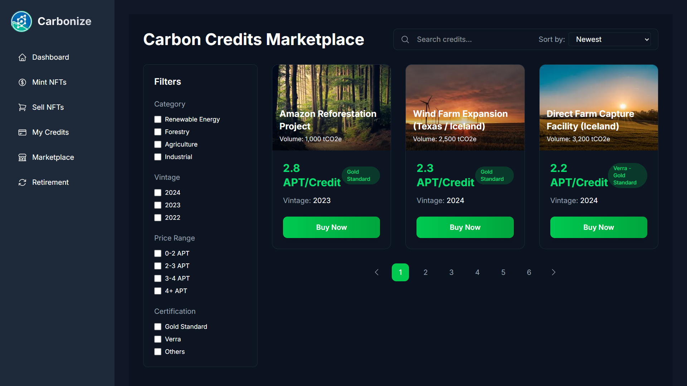
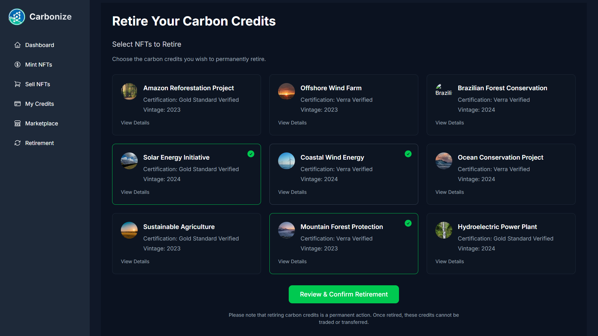

<div align="center">
  
  <p><h4>Making Carbon Credit Trading Transparent, Traceable, and Global.</h4></p>

<br/>
<p align="center">
  
  
  
  
  
  
  <br/>
  
</p>

<p align="center">
  
</p>
</div>

### 📌 Submitted on Aptos Ctrl+Move Hackathon
Carbonize is a decentralized carbon credit trading and management platform built on blockchain. It enables individuals and organizations to seamlessly buy, sell, and retire tokenized carbon credits while ensuring full transparency, traceability, and global accessibility in climate action.


## Live Demos & Deliverables
- **Demo Video (Click below to watch the youtube video):** - [Carbonize BuildShowcase | Project Demo]() <br>
<a href="" target="_blank">


</a>

- **For Demo Experience** - Scroll below ↓

---

## 🎯 Objective
### **What Problem Does Our Project Solve?**

**Carbonize** is a decentralized platform that simplifies how companies and organizations use carbon credits to offset their carbon emissions and demonstrate measurable CO₂ reduction. By **tokenizing carbon credits** on the blockchain, Carbonize ensures **transparency**, **traceability**, and **security in every transaction**. This allows businesses to easily buy, sell, and verify carbon credits in real time, creating a trusted and efficient carbon marketplace. Through this system, Carbonize empowers organizations to prove their environmental impact while contributing to global sustainability efforts.

### **Who Does It Serve?**

**Carbonize** empowers a diverse range of participants in the carbon credit ecosystem, creating a transparent and efficient platform for everyone involved in climate action.

🌍 **Project Developers** – Easily tokenize verified carbon credits and access global liquidity with 24/7 trading opportunities.

🏢 **Enterprises** – Seamlessly offset carbon emissions while showcasing verifiable sustainability efforts to customers and stakeholders.

🤝 **Brokers & Traders** – Benefit from a decentralized marketplace with instant settlements, clear pricing, and enhanced market access.

💚 **Individuals** – Effortlessly buy, sell, or retire carbon credits, enabling direct participation in global climate action.

By bringing all these participants together through **blockchain technology**, Carbonize fosters trust, transparency, and efficiency in the carbon credit market.

---

## 🧠 Our Approach

### **Why We Choose This Problem**

The carbon credit market today is fragmented, opaque, and inefficient. Verified carbon credits are scattered across multiple registries and traded through slow, centralized intermediaries. Participants — from enterprises to individuals — often struggle to verify authenticity, track ownership, or access liquidity. As a result, the process of offsetting carbon emissions remains limited to large corporations with specialized access.

We chose this problem because climate action should be transparent, accessible, and global. While organizations worldwide are pledging to go carbon-neutral, the lack of trust, traceability, and ease of participation prevents meaningful progress.

Carbonize changes that. By tokenizing carbon credits on the Aptos Layer 1 blockchain, we bring transparency, accessibility, and real-time trading to the carbon economy — empowering individuals, enterprises, and project developers to actively participate in reducing carbon emissions.

### **How We Solved This**

1️⃣ **Tokenization of Carbon Credits**<br>
We built a system that converts verified carbon credits into digital tokens on the Aptos blockchain, ensuring immutability, traceability, and global tradability.

2️⃣ **Decentralized Marketplace**<br>
A transparent, blockchain-powered marketplace where project developers, enterprises, and brokers can buy, sell, or retire carbon credits with instant settlement and verifiable transactions.

3️⃣ **Real-Time Tracking & Verification**<br>
Every transaction — from token issuance to retirement — is recorded on-chain, enabling real-time verification and public accountability for carbon offset claims.

4️⃣ **Seamless Integration via Web SDK**<br>
Carbonize SDK allows businesses and dApps to integrate carbon offset features directly into their platforms, making sustainability an effortless add-on.

5️⃣ **Incentivized Participation through Rewards**<br>
Users and organizations can earn digital rewards or NFTs for verified climate-positive actions — creating a gamified ecosystem for environmental responsibility.

### **✨ Key Features**

Major Highlights of Our Project

✅ Tokenized Carbon Credits —> Transform verified credits into digital assets on Aptos for transparent trading.<br>
✅ Decentralized Marketplace —> Buy, sell, or retire carbon credits instantly with on-chain verification.<br>
✅ Carbonize SDK Integration —> Plug-and-play SDK for adding carbon offsetting to any dApp or enterprise tool.<br>
✅ Transparent Tracking —> Every action recorded on-chain for public verification and trust.<br>
✅ NFT Reward System —> Recognize and reward eco-conscious users and partners.<br>
✅ Powered by Aptos Layer 1 Blockchain —> Ensures scalability, speed, and security for a truly global carbon economy.

## 🛠️ Tech Stack

### Carbonize - Web SDK:
- #### Frontend
  - **Next.js (React):** Framework for rendering the UI, routing, and providing server-side capabilities (for API routes/indexers).

  - **Tailwind CSS:** Utility-first CSS framework for rapid and responsive styling.


- #### Aptos Interaction
  - **aptos-labs/ts-sdk:** The official TypeScript SDK for constructing and submitting transactions, and fetching on-chain data.

  - **aptos-labs/wallet-adapter-react:** Hooks and context providers to easily connect popular Aptos wallets (Petra, Martian, etc.) to your React application.
---
## How it looks (UI Walkthrough)! 
<div align="left">
  
  
  
  
  
  
</div>


---

## Carbonize Architecture:


##  Run Locally

### Prerequisites
- [Node.js](https://nodejs.org/) (v18 or higher recommended)
- [pnpm](https://pnpm.io/) or npm

### Clone the Repository
```bash
git clone https://github.com/kaushik122247/Carbonize-DAPP
cd Carbonize-DAPP
```

### Install Dependencies
You can use either pnpm or npm.

- Using pnpm (recommended)
```
pnpm install
```

- Using npm
```
npm install
```

### Start the Development Server
- Using pnpm
```
pnpm run dev
```

- Using npm
```
npm run dev
```

### Open in Browser

Once the server starts, open your browser and go to:
```
http://localhost:3000
```


### 👋Connect with us:  

<table align="left">
  <tr>
    <td></td>
    <td><h4>Built by the Carbonize Team</h4></td>
  </tr>
  <tr>
    <td colspan="2" align="center">
      <table>
        <tr>
          <td align="center">
            <a href="https://github.com/kaushik122247">
              <br>
              <sub><b>@kaushik122247</b></sub>
            </a>
          </td>
          <td align="center">
            <a href="https://github.com/Pushpender-18">
              <br>
              <sub><b>@Pushpender-18</b></sub>
            </a>
          </td>
          <td align="center">
            <a href="https://github.com/Sushant1407">
              <br>
              <sub><b>@Sushant1407</b></sub>
            </a>
          </td>
          <td align="center">
            <a href="https://github.com/Taran206">
              <br>
              <sub><b>@Taran206</b></sub>
            </a>
          </td>
        </tr>
      </table>
    </td>
  </tr>
</table>

<div align="center"> <strong>We're actively building, debugging, and prototyping —<br>drop a ⭐, share your feedback, or just vibe with us!</strong> <br/><br/>  </div>

